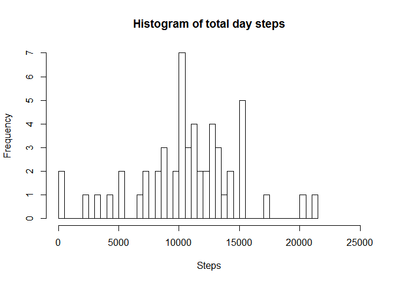
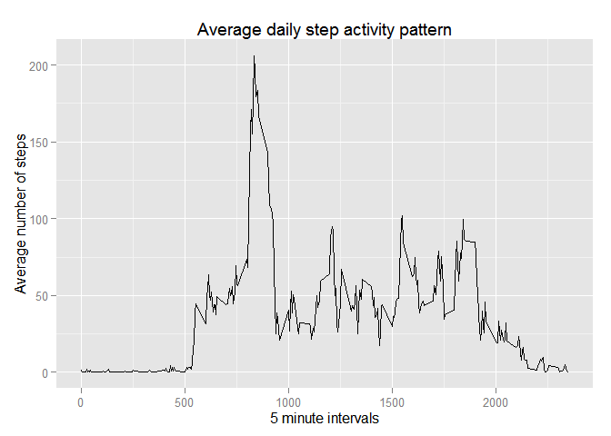
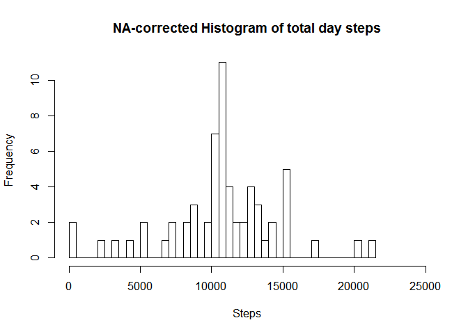
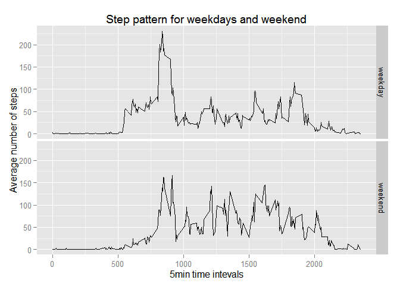

*Coursera PA 1 Step dataset*
============================

Sunday, April 19, 2015
----------------------

<br /> <br />

Packages
--------

<br /> Loading packages (ggplot2 and xtable).

``` r
library(ggplot2)
```

    ## Warning: package 'ggplot2' was built under R version 3.1.3

``` r
library(xtable)
```

<br /> <br />

Cleaning
--------

<br /> Cleaning up the data making ready for use.

``` r
act <- read.csv("activity.csv")
act$date <- as.character(act$date)
act$date <- as.Date(act$date, "%Y-%m-%d")
```

<br /> <br />

Plotting
--------

<br /> **Extracting aggregated data for total steps histogram plot.** **Plotting histogram and returning aggregated data summary with mean and median.**

``` r
actdaysteps <- aggregate(steps ~ date, act, sum)
hist(actdaysteps$steps, breaks = 40, main = "Histogram of total day steps", ylab = "Frequency", xlab = "Steps", xlim = c(0,25000))
```

 <br /> Summary data, mean and median for the initial set.

``` r
summary(actdaysteps$steps)
```

    ##    Min. 1st Qu.  Median    Mean 3rd Qu.    Max. 
    ##      41    8841   10760   10770   13290   21190

<br /> <br /> <br /> **Extracting aggregated data for step mean per interval line plot.** **Plotting line graph and returning the interval with maximum steps and number of lines with NA values.**

``` r
actintsteps <- aggregate(steps ~ interval, act, mean)
qplot(actintsteps$interval, actintsteps$steps, geom="line", xlab = "5 minute intervals", ylab = "Average number of steps", main = "Average daily step activity pattern")
```

 <br /> 5 minute interval with the highest amount of steps on average.

``` r
actintsteps[actintsteps$steps==max(actintsteps$steps),]
```

    ##     interval    steps
    ## 104      835 206.1698

<br /> Number of NA-lines of the initial set.

``` r
nrow(act[!complete.cases(act),])
```

    ## [1] 2304

<br /> <br /> <br /> **Reworking the data to apply interval average value on the missing step data lines.**

``` r
oldact <- act
na <- act[!complete.cases(act),]
act[!complete.cases(act),]$steps <- actintsteps$steps[match(actintsteps$interval, na$interval)]
newact <- act
rm(act)
```

<br /> <br /> <br /> **Extracting aggregated data for total steps histogram plot. NA's corrected** **Plotting histogram and returning aggregated data summary with mean and median. NA's corrected**

``` r
newactdaysteps <- aggregate(steps ~ date, newact, sum)
hist(newactdaysteps$steps, breaks = 40, main = "NA-corrected Histogram of total day steps", ylab = "Frequency", xlab = "Steps", xlim = c(0,25000))
```

 <br /> Summary data, mean and median for the initial set.

``` r
summary(newactdaysteps$steps)
```

    ##    Min. 1st Qu.  Median    Mean 3rd Qu.    Max. 
    ##      41    9819   10770   10770   12810   21190

<br /> <br /> <br /> **Reworking the data to add weekday and weekend tags.**

``` r
newact$day <- weekdays(as.Date(newact$date))
newact$day[newact$day == "maandag"] <- "weekday"
newact$day[newact$day == "dinsdag"] <- "weekday"
newact$day[newact$day == "woensdag"] <- "weekday"
newact$day[newact$day == "donderdag"] <- "weekday"
newact$day[newact$day == "vrijdag"] <- "weekday"
newact$day[newact$day == "zaterdag"] <- "weekend"
newact$day[newact$day == "zondag"] <- "weekend"
```

<br /> <br /> <br /> **Extracting aggregated data for step mean per interval line plot.** **Plotting line graph with weekday/weekend - facets.**

``` r
ncdayint <- aggregate(steps ~ day+interval, newact, mean)
ggplot(ncdayint, aes(x=interval, y=steps)) + geom_line() + facet_grid(day ~ .) + xlab("5min time intevals") + ylab("Average number of steps") + ggtitle("Step pattern for weekdays and weekend")
```


